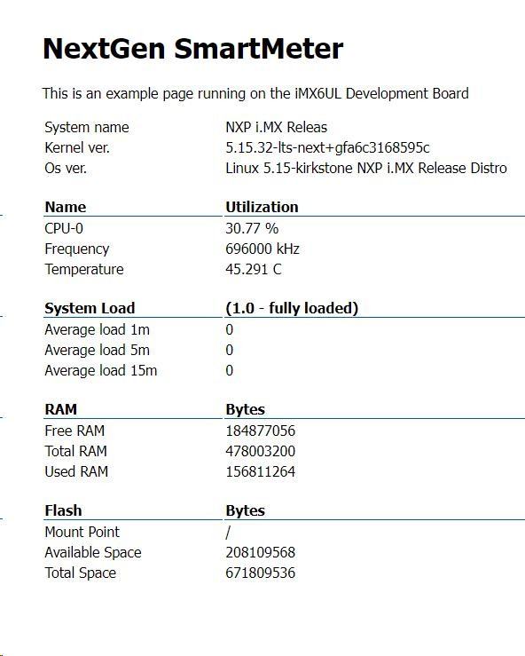

# WEBMONITOR  

  
This is a simple webserver which provides system info on a static web page.  
It also provides a REST api which the page uses in the background to refresh the data.
  
Webpage: {serveraddr}:80/app  
REST endpoint: {serveraddr}:80/sysinfo  

## Building
```
$ cargo build
```
## Yocto recipe creation  
```
$ cargo bitbake
```  
For this bitgake plugin needs to be installed ```$ cargo install --locked cargo-bitbake```

## Running  
Copy contents of *webpage/* folderto a folder of your choice, then start webmonitor like this:  

```
web_monitor /path/to/webpage/folder
```  
After this page can be viewer on http://localhost:80/app  


